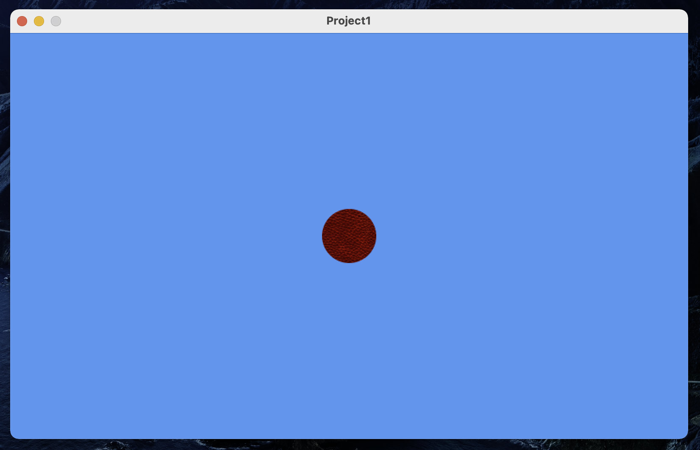

# mg-pong

This project contains my code from the MonoGame beginning setup tutorial. You can find the instructions here: [https://docs.monogame.net/articles/getting_started/0_getting_started.html](https://docs.monogame.net/articles/getting_started/0_getting_started.html).

